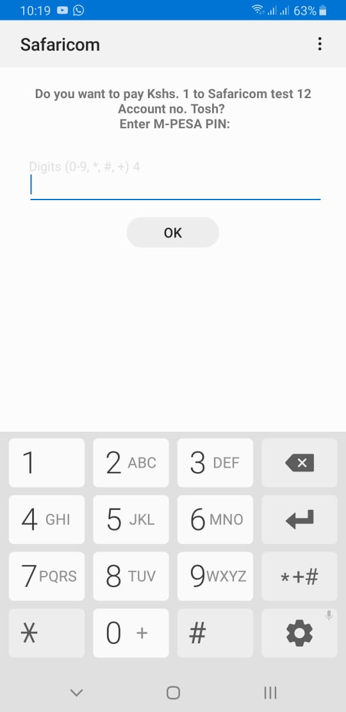

# Mpesa Daraja STK-Push Nodejs App
This app implements the Online lipa na mpesa api

# Prerequisites
1. Node v6+, 8+ recommended.
2. ExpressJs
3. ES6 knowledge
4. Api Key and Secret from https://developer.safaricom.co.ke/home

# Installation
1. npm i mpesa-online 
2. npm i express

# Description and Usage
To test the app, run it on postman a successful request will be similar to the one below.

### Support or questions
For any questions feel free to contact me through raytosh95@gmail.com

## Contributors
Raymond Gitonga

## License
MIT 2019

